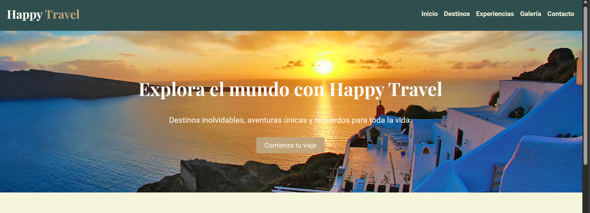

# ✈️ Happy Travel — Vive tu próxima aventura

¡Bienvenido a **Happy Travel**, donde cada destino es una historia esperando ser vivida!  
Esta landing page fue creada como parte de un proyecto académico en la asignatura de **Digitalización**, con el objetivo de demostrar cómo una agencia puede potenciar su presencia online a través del diseño web moderno y funcional.

---

## 🌟 ¿Qué es Happy Travel?

**Happy Travel** es una agencia de viajes ficticia diseñada con alma, enfocada en ofrecer experiencias únicas alrededor del mundo.  
Esta página web sirve como escaparate para sus destinos más emblemáticos, invitando al usuario a comenzar su próxima aventura con solo un clic.

---

## 📸 Vista previa

  

---

## 🔧 Tecnologías utilizadas

- HTML5
- CSS3
- Google Fonts
- Figma (para el diseño visual)

---

## 🧭 ¿Qué encontrarás en la página?

- Hero con mensaje inspirador
- Destinos turísticos destacados
- Formulario de contacto (estático)
- Diseño responsive y moderno

---

## 🎨 Diseño UI

Maqueta de referencia:  
👉 [Ver diseño en Figma]([https://www.figma.com/design/TuRvUhSC0wqOUBgXGWV92N/HappyTravel?node-id=0-1&m=dev&t=8JHzftz8zEtdhgFW-1](https://www.figma.com/design/ICYbKjj5x5GyatR2kHAgIv/HappyTravel--Copy-?node-id=0-1&m=dev&t=As4cMO85yXScDAOb-1))

Colores usados:
- Marrón 🍂
- Beige ☕
- Verde 🌿
- Dorado ✨

---

## 🧑‍💻 Autor

**Oumniya Chahidi**  
Estudiante de Cei Sevilla.  
Proyecto para la asignatura de **Digitalización**  
Año: 2025

---
